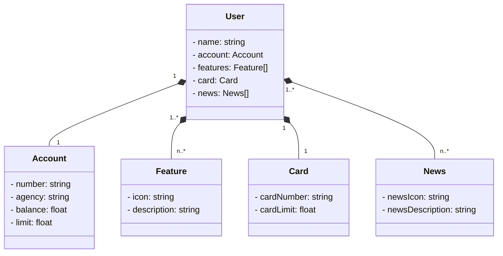

# santander Dev Week 2023
Java RESTful API criada para o santander Dev Week.

## Diagrama de Classes

```mermaid

classDiagram
  class User {
    - name: string
    - account: Account
    - features: Feature[]
    - card: Card
    - news: News[]
  }
  
  class Account {
    - number: string
    - agency: string
    - balance: float
    - limit: float
  }
  
  class Feature {
    - icon: string
    - description: string
  }
  
  class Card {
    - cardNumber: string
    - cardLimit: float
  }
  
  class News {
    - newsIcon: string
    - newsDescription: string
  }
  
  User "1" *-- "1" Account
  User "1..*" *-- "n..*" Feature
  User "1" *-- "1" Card
  User "1..*" *-- "n..*" News

```
